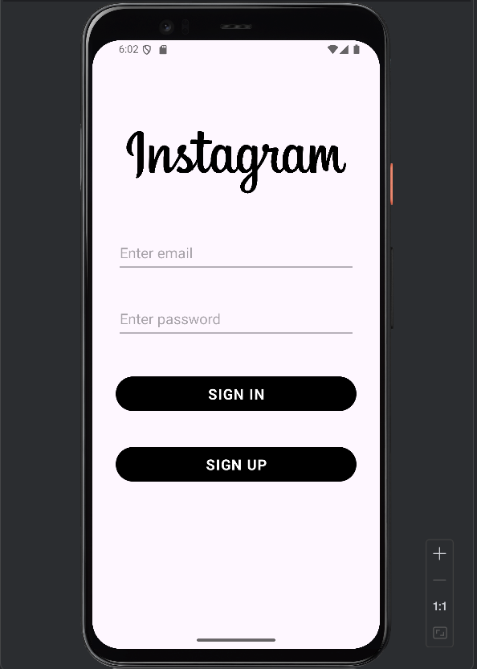
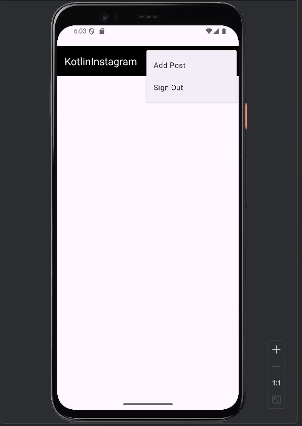
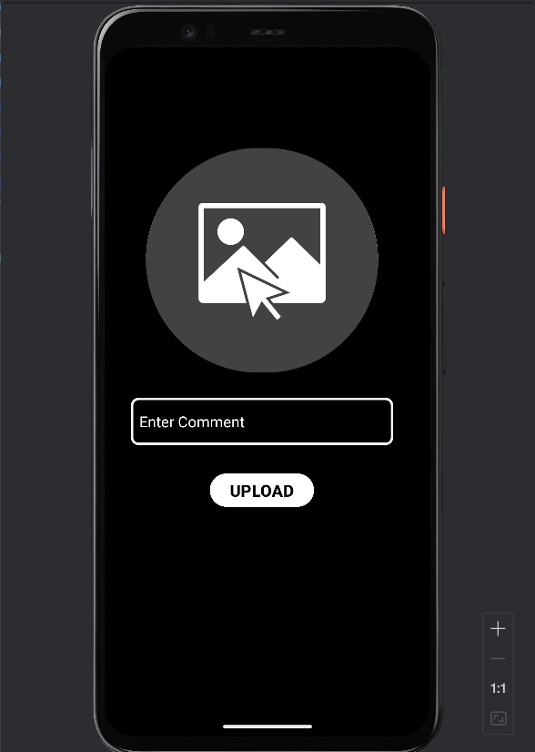
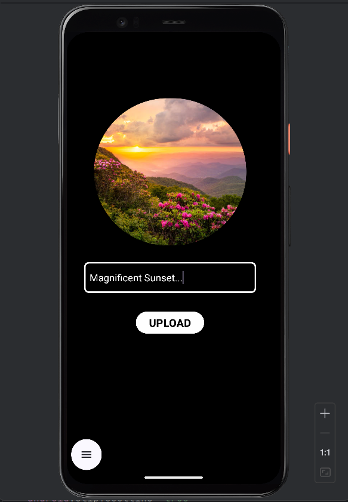
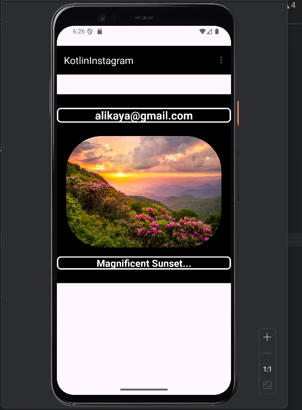

Instagram Clone
This project is an Instagram-like application developed for the Android platform using Kotlin. Firebase, Firestore, and Firebase Storage are used to allow users to upload photos, comment, and view posts. The application simulates social media interactions in a simple way.

Features
User Login and Logout: User login and logout are handled using Firebase Authentication.
Photo Upload: Users can select a photo and upload it to Firebase Storage. The photos will be displayed in the users' feed.
Feed: Users can view the photos and comments posted by other users on a "Feed" screen.
Database: Firestore database stores user posts and comments. Data is displayed in an ordered manner.

Requirements
Android Studio
Kotlin
Firebase

Technologies
Kotlin: The primary programming language used for the Android application.
Firebase Authentication: Handles user authentication.
Firebase Firestore: Stores user data, posts, and comments.
Firebase Storage: Stores photos in the cloud.
RecyclerView: Used to list posts and comments.

Screenshots

